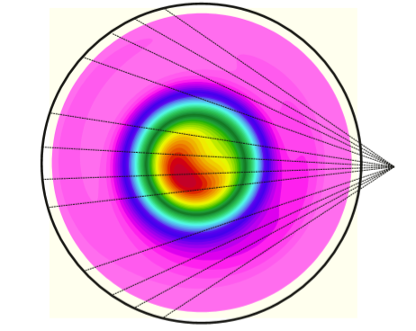

## Portfolio

---
[Modelling of magnetohydrodynamic instabilities](/sample_page)

---
[Tomographic reconstruction of Soft X-ray emission (optimization problem)](/pdf/SXR_RF.pdf)

---
[Magnetic field line tracing](http://example.com/)

---

---

Page template forked from <a href="https://github.com/evanca/quick-portfolio">evanca</a>

<!-- Remove above link if you don't want to attibute -->
